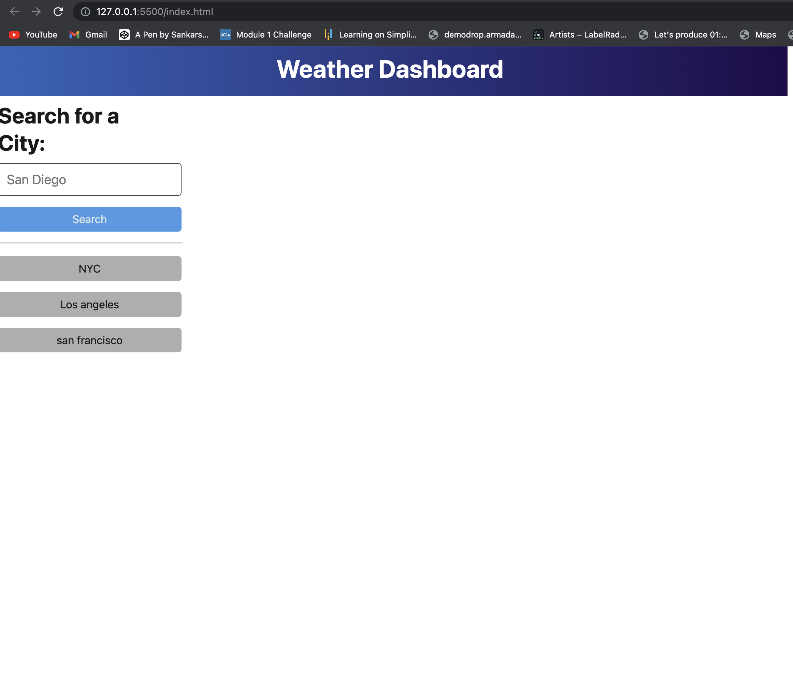

# Weather-API-Dashboard

## Description

- What was your motivation?
    My motivation behind this project was to utilize a web server API to gather data and populate my HTML page. To use a framework I had not yet used. To use javascript commands that felt uncomfortable for me to use. 
- Why did you build this project?
    I built this project in order to practice styling using materialize which was a framework that I havent used before. Practice and showcase my abilites in being able to work with webserver API's. I also wanted to challenge myself with the use of local storage which was once was a challenge for me to master. 
- What problem does it solve?
    Some of the problems in my code was using Materialize as well as trying to use an API then using day.js to format a date given from the weather API. It used local storage which was a challenge for me before using this assignment to populate buttons of previous searches from the user and the user can click those buttons to then search the weather for the cities that they are intrested in. 
- What did you learn?
    I learned how to effectivily use a fetch request in JavaScript, I also was able to parse data from the API to manipulate it using. I learned how to use Materalize my layout.

## Installation

In order to use the webpage, click on the URL link below. 

https://sankyrajeev.github.io/Weather-Dashboard/

## Usage

As the user you want to check the weather, you enter the name of the city that you want to check the weather for. The webpage will populate the weather for the day and give you a five day weather forecast. The webpage will then make a button from the city that you searched for and as the user, you can click on that button to search for that city weather without having to type in the city again. 

## Credits

